# Model Car Wash Project

https://github.com/user-attachments/assets/e309d9ca-9c4e-4a33-9c9b-94e67e3d3a1e

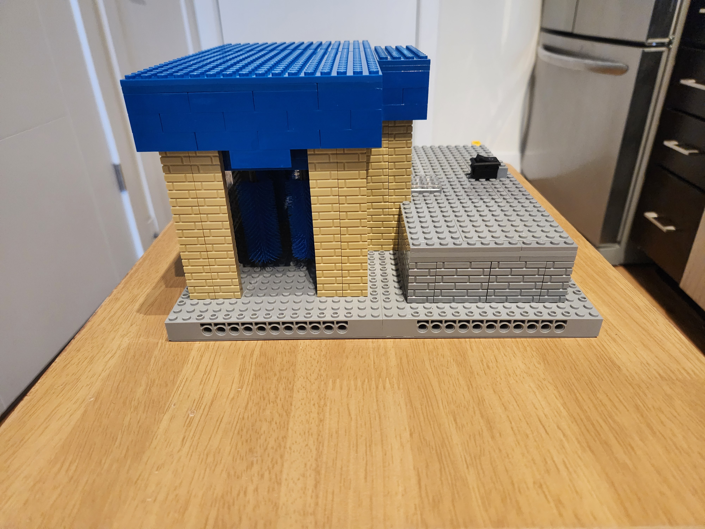

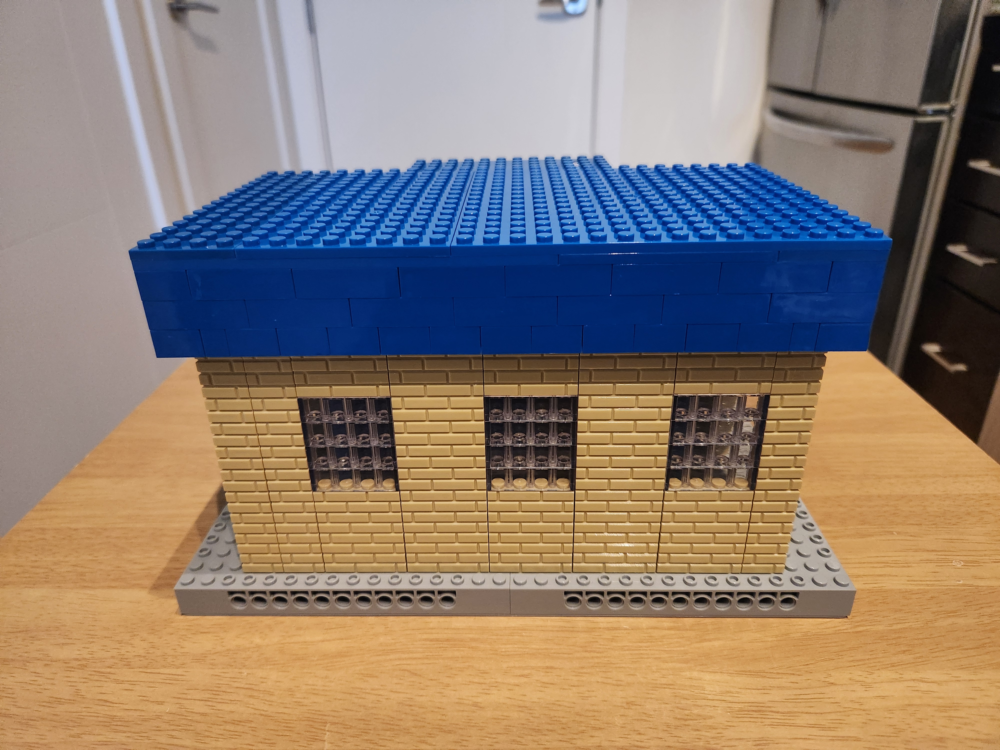

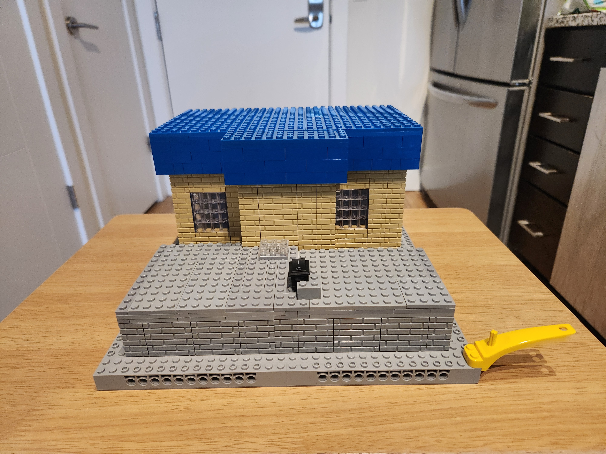

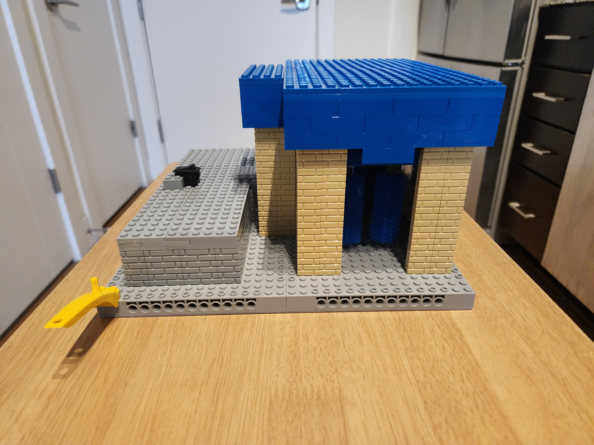

## About

A model car wash project with the primary objective of efficiently and effectively controlling six DC motors simultaneously.

## Software

- [DipTrace 5.2](https://diptrace.com/download/download-diptrace/)
- [Arduino IDE 2.3.7](https://www.arduino.cc/en/software/)
- [Teensyduino 1.59](https://www.pjrc.com/teensy/td_download.html)

## Hardware

### Components List

<table style="width: auto;">
  <tr>
    <th style="text-align: center;">Quantity</th>
    <th style="text-align: center;">Component</th>
    <th>Name</th>
    <th>Notes</th>
  </tr>
  <tr>
    <td style="text-align: center;">10</td>
    <td>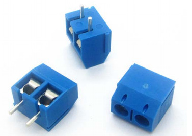</td>
    <td>2 Hole Screw Terminals</td>
    <td>Used to attach any wired components to the printed circuit board (PCB).</td>
  </tr>
  <tr>
    <td style="text-align: center;">1</td>
    <td style="width: auto">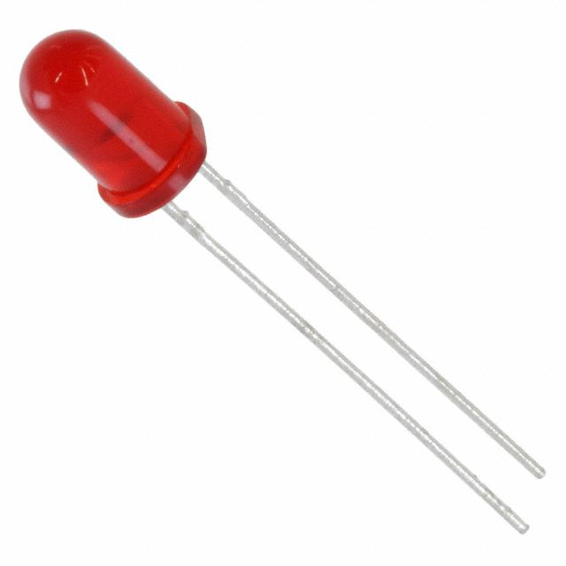</td>
    <td>LED</td>
    <td>Signals whether the circuit board is powered on or not.</td>
  </tr>
  <tr>
    <td style="text-align: center;">1</td>
    <td>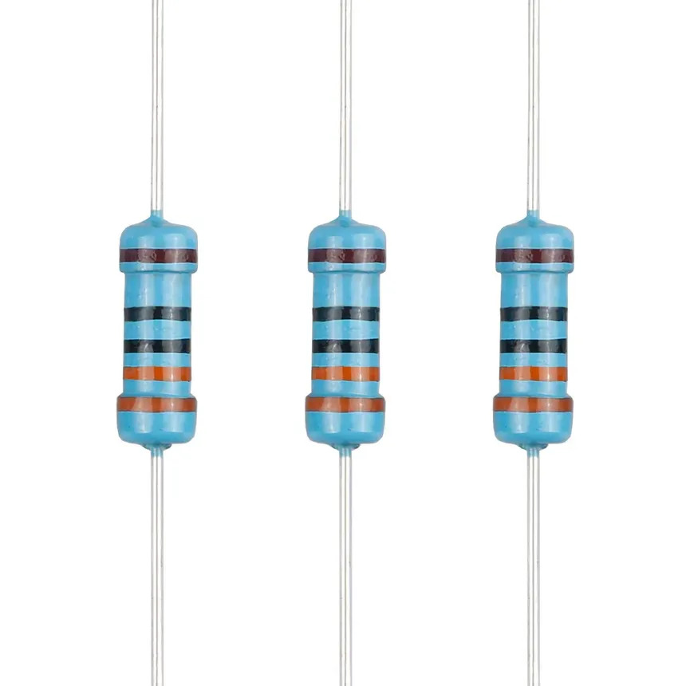</td>
    <td>330 Ohm Resistor</td>
    <td>Limits the electrical current flowing through the LED to prevent damage.</td>
</tr>
  <tr>
    <td style="text-align: center;">3</td>
    <td>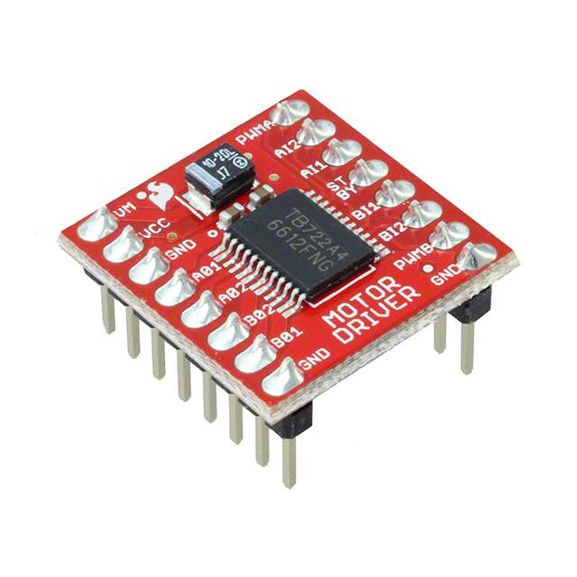</td>
    <td>TB6612FNG Motor Driver</td>
    <td>Controls the speed and direction of the motors attached to the circuit board.</td>
</tr>
  <tr>
    <td style="text-align: center;">6</td>
    <td>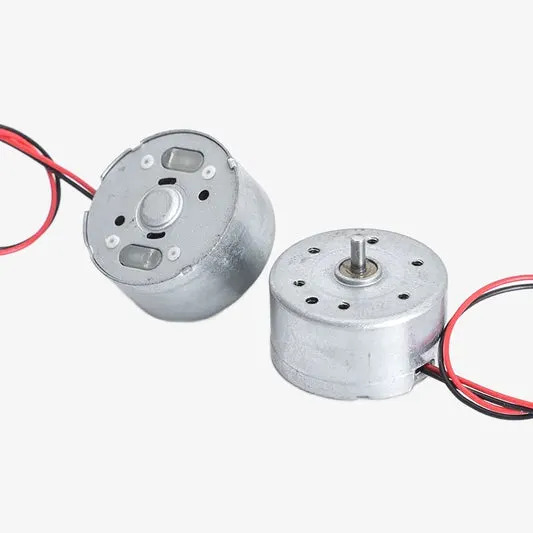</td>
    <td>DC Motor</td>
    <td>The primary component in the project that will be controlled by the motor drivers and microcontroller.</td>
</tr>
  <tr>
    <td style="text-align: center;">1</td>
    <td></td>
    <td>Teensy 4.1</td>
    <td>Gives the motor controllers instruction on how to operate within the circuit board.</td>
</tr>
  <tr>
    <td style="text-align: center;">1</td>
    <td>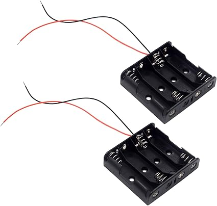</td>
    <td>4 AA Battery Latch</td>
    <td>Will hold the 1.5 volt batteries used to power the circuit board.</td>
</tr>
  <tr>
    <td style="text-align: center;">1</td>
    <td>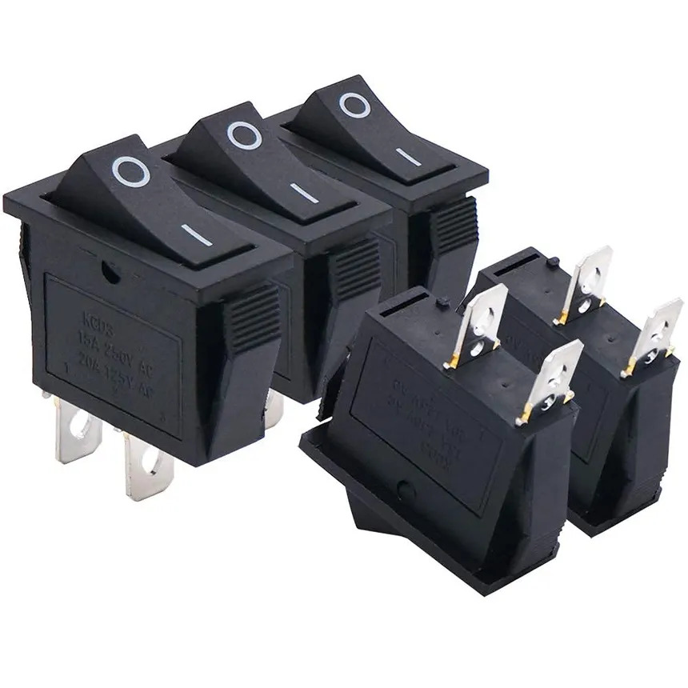</td>
    <td>2 Pin Rocker Switch</td>
    <td>Bridges the power between the batteries and the circuit board, which powers the board on and off manually.</td>
</tr>
  <tr>
    <td style="text-align: center;">1</td>
    <td>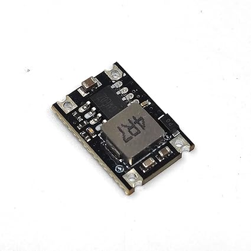</td>
    <td>5V Step-Down Buck Converter</td>
    <td>Reduces higher input voltage to a stable 5 volts output to the microcontroller.</td>
</tr>
  <tr>
    <td style="text-align: center;">4</td>
    <td>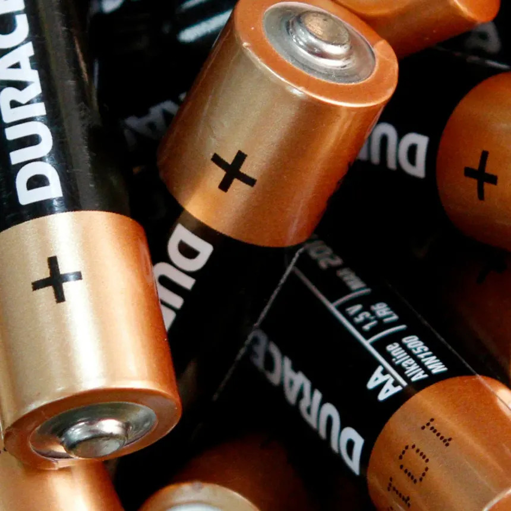</td>
    <td>1.5V AA Battery</td>
    <td>Used to power the circuit board.</td>
  </tr>
</table>

#### Optional

<table style="width: auto; text-align: left;">
  <tr>
    <th style="text-align: center;">Quantity</th>
    <th style="text-align: center;">Component</th>
    <th>Name</th>
    <th>Notes</th>
  </tr>
  <tr>
    <td style="text-align: center;">6</td>
    <td>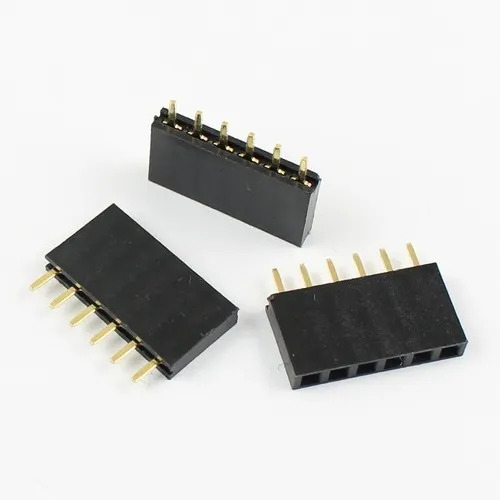</td>
    <td>Female 6 Pin Header</td>
    <td>Used to make the TB6612FNG motor drivers removable.</td>
  </tr>
  <tr>
    <td style="text-align: center;">2</td>
    <td style="width: auto">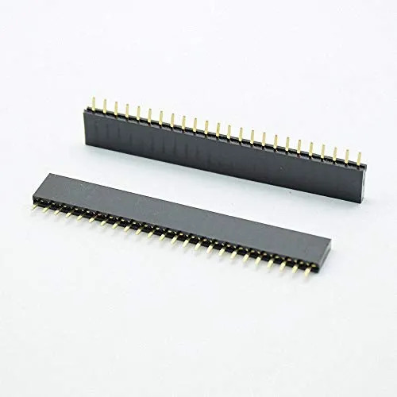</td>
    <td>Female 24 Pin Header</td>
    <td>Used to make the Teensy 4.1 microcontroller removable.</td>
  </tr>
</table>

### Pin Connections

<table style="width: auto;">
  <tr>
    <th style="text-align: center;">Pin Name</th>
    <th style="text-align: center;">Digital Pin</th>
    <th style="text-align: center;">Analog Pin</th>
    <th style="text-align: center;">PWM* Enabled</th>
  </tr>
  <tr>
    <td style="text-align: center;">AIN1_1</td>
    <td style="text-align: center;">14</td>
    <td style="text-align: center;">A0</td>
    <td style="text-align: center; color: lightgreen;">Yes</td>
  </tr>
  <tr>
    <td style="text-align: center;">AIN2_1</td>
    <td style="text-align: center;">15</td>
    <td style="text-align: center;">A1</td>
    <td style="text-align: center; color: lightgreen;">Yes</td>
  </tr>
  <tr>
    <td style="text-align: center;">BIN1_1</td>
    <td style="text-align: center;">16</td>
    <td style="text-align: center;">A2</td>
    <td style="text-align: center; color: indianred;">No</td>
  </tr>
  <tr>
    <td style="text-align: center;">BIN2_1</td>
    <td style="text-align: center;">17</td>
    <td style="text-align: center;">A3</td>
    <td style="text-align: center; color: indianred;">No</td>
  </tr>
  <tr>
    <td style="text-align: center;">PWMA_1</td>
    <td style="text-align: center;">18</td>
    <td style="text-align: center;">A4</td>
    <td style="text-align: center; color: lightgreen;">Yes</td>
  </tr>
  <tr>
    <td style="text-align: center;">PWMB_1</td>
    <td style="text-align: center;">19</td>
    <td style="text-align: center;">A5</td>
    <td style="text-align: center; color: lightgreen;">Yes</td>
  </tr>
  <tr>
    <td style="text-align: center;">AIN1_2</td>
    <td style="text-align: center;">20</td>
    <td style="text-align: center;">A6</td>
    <td style="text-align: center; color: indianred;">No</td>
  </tr>
  <tr>
    <td style="text-align: center;">AIN2_2</td>
    <td style="text-align: center;">21</td>
    <td style="text-align: center;">A7</td>
    <td style="text-align: center; color: indianred;">No</td>
  </tr>
  <tr>
    <td style="text-align: center;">BIN1_2</td>
    <td style="text-align: center;">40</td>
    <td style="text-align: center;">A16</td>
    <td style="text-align: center; color: indianred;">No</td>
  </tr>
  <tr>
    <td style="text-align: center;">BIN2_2</td>
    <td style="text-align: center;">41</td>
    <td style="text-align: center;">A17</td>
    <td style="text-align: center; color: indianred;">No</td>
  </tr>
  <tr>
    <td style="text-align: center;">PWMA_2</td>
    <td style="text-align: center;">24</td>
    <td style="text-align: center;">A10</td>
    <td style="text-align: center; color: lightgreen;">Yes</td>
  </tr>
  <tr>
    <td style="text-align: center;">PWMB_2</td>
    <td style="text-align: center;">25</td>
    <td style="text-align: center;">A11</td>
    <td style="text-align: center; color: lightgreen;">Yes</td>
  </tr>
  <tr>
    <td style="text-align: center;">AIN1_3</td>
    <td style="text-align: center;">26</td>
    <td style="text-align: center;">A12</td>
    <td style="text-align: center; color: indianred;">No</td>
  </tr>
  <tr>
    <td style="text-align: center;">AIN2_3</td>
    <td style="text-align: center;">27</td>
    <td style="text-align: center;">A13</td>
    <td style="text-align: center; color: indianred;">No</td>
  </tr>
  <tr>
    <td style="text-align: center;">BIN1_3</td>
    <td style="text-align: center;">38</td>
    <td style="text-align: center;">A14</td>
    <td style="text-align: center; color: indianred;">No</td>
  </tr>
  <tr>
    <td style="text-align: center;">BIN2_3</td>
    <td style="text-align: center;">39</td>
    <td style="text-align: center;">A15</td>
    <td style="text-align: center; color: indianred;">No</td>
  </tr>
  <tr>
    <td style="text-align: center;">PWMA_3</td>
    <td style="text-align: center;">22</td>
    <td style="text-align: center;">A8</td>
    <td style="text-align: center; color: lightgreen;">Yes</td>
  </tr>
  <tr>
    <td style="text-align: center;">PWMB_3</td>
    <td style="text-align: center;">23</td>
    <td style="text-align: center;">A9</td>
    <td style="text-align: center; color: lightgreen;">Yes</td>
  </tr>
</table>

* Pulse-Width Modulation: controls motor speed.

### 3D Rendered PCB

<table style="width: auto;">
  <tr>
    <th style="text-align: center;">Without Components</th>
    <th style="text-align: center;">With Components</th>
  </tr>
  <tr>
    <td>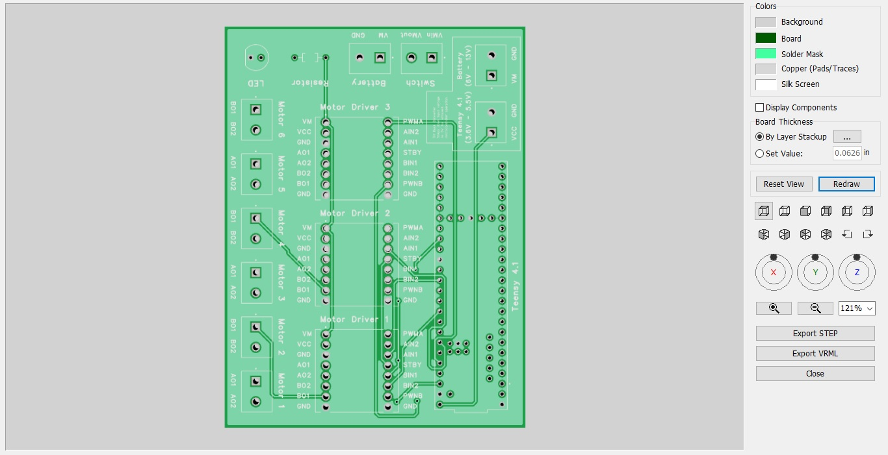</td>
    <td>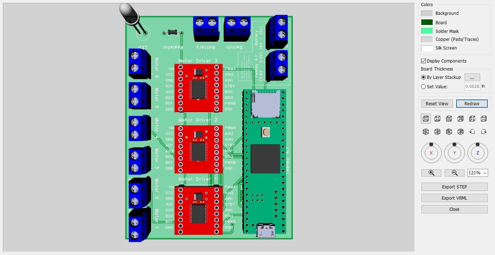</td>
  </tr>
</table>

### Video Demonstration

https://github.com/user-attachments/assets/6ffc5e24-8c43-4aa4-a156-bba197fbcea6

## Warning

DO NOT connect to power or power on the Teensy and connect to the USB port concurrently. Doing so can damage the microcontroller.

Follow this [guide](https://www.pjrc.com/teensy/external_power.html) if you want to use power and the USB port concurrently.
